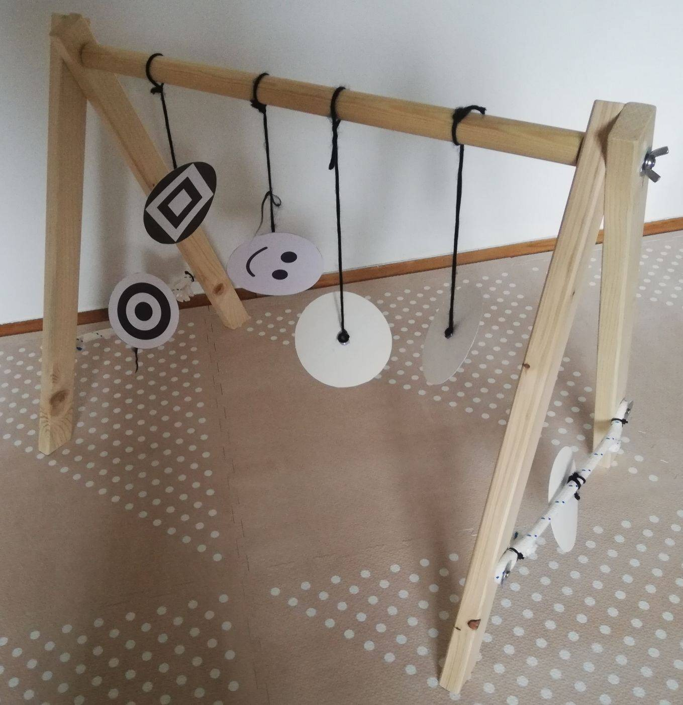

# Arch Baby
## Baby Activity Arch

This repository contains blueprints and Freecad 3D models for a simple wooden activiy arch.
One extra feature is that it can be dissasembled with 2 screws (without any tools).

# Technical documentation
Assembly drawing with a bill of materials and 2 technical drawings should be enough for you to create your own baby arch! They are located in the [drawings](drawings/) directory.
